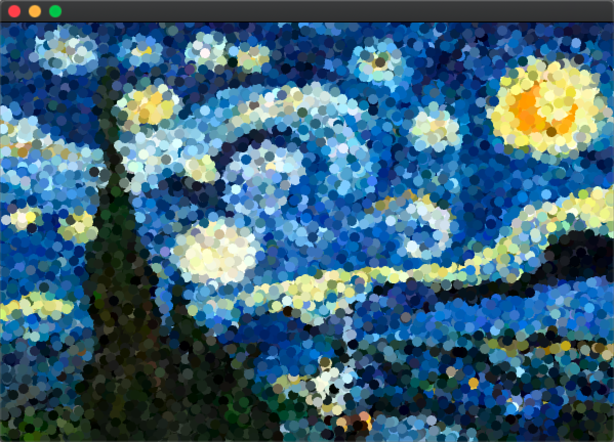

# 快速柏松盘采样

Date: Apr 18, 2020
Tags: done

快速柏松盘采样算法原理

这个算法名字我一开始也搞错了。我以为是和柏松分布有关系，但是我发现并不是这么个东西。不过说来柏松分布也非常有意思，不过目前没有发现什么搞头。

简单来说这个算法就是用于采样。比如说一个很经典的，我想要从图片像素中pick一些像素点，取rgb颜色重新绘制到图片中。那么如何确定采集哪些地方呢，可能想到的方法是用random的方法去取数。比如说我的这个项目：待上传

这个图片的是用随机采样的算法来做的。可以看到有一些“像素点”是重合在一起的。即使降低了半径和采样比例

会看到有很多空隙 但是也有一些是重叠在一起的。而这个图则是柏松采样的结果：

可以看到点是均匀分布在图上的。如果查看原来的采样点应该是这样的：

基本上这个算法的原理是，随机取一些点，要保证点和点之间不要距离太远，使之均匀分布在平面上。当然我这个案例源代码可能还有一些缺陷，可以看到上面点图有一些点距离过近了，但是没有重叠的现象。当时写的时候为了保证不越界做了一些保护措施，不知道是不是因为这个原因有时候效果不是十分好。以后有机会可以优化一下。

我看了很多教程解释快速柏松盘采样的原理，都觉得解释的不够简练。直到看到CSDN一篇文章：

[图形学进阶技巧（十二）泊松盘采样（Poisson Disk Sampling）生成随机点_matlab_Clatterrr-CSDN博客](https://blog.csdn.net/qq_43439240/article/details/104328586)

简单来说是这么个意思：

1. 确定需要的点数n，创建一个网格，确保网格格子数大于等于n，让每个格子里有至多一个点
2. 随机选择一个点，创建两个数组，输出数组，以及处理数组，将这个点放进这两个数组
3. 随机选择处理数组中的一个点，将这个点从处理数组中去掉
4. 在点的周围的一共环形里生成一系列随机的新点，30个左右
5. 删掉与原有的点相隔的太近的点
6. 将剩下的点加入输出数组，处理数组
7. 如果处理数组中还有点，继续第3步，否则输出数组就是结果。

当然如果对原来算法感兴趣的可以看这篇：

[fast_poisson_disk_sampling.pdf](Untitled/fast_poisson_disk_sampling.pdf)

源代码贴github了，基于OpenFrameowrk。

这个流程的具体代码思路是，第一步建立两个list，一个用于储存已经采样好的点（grid），另一个用于储存用于下一个用于采样的采样点。

一开始你要定一个r 和 k。 r有点像我们的分辨率的意思， 就是点和点之间的间距，间距越小可以容纳的点就越多。

同时根据这个r来制作一个grid。其实就是在屏幕上画一个栅格。

要保证一个栅格只有一个点。因为这里是正方形（误），所以只要保证正方形的对角线等于r就可以了。这样只要超出了一个格子周围的8格的范围是绝对大于r的，接下来就只需要验证相邻格子的距离是否大于r就可以了。

最开始肯定是没有点的，随便取一个就可以。

然后进行验证，以这个点为圆心，向外扩散一个从 r 到 2r之间的圆环：

在这里随便找三十个点（一次找一个，一共找最多30次）。

然后开始验证，首先验证有没有越界 因为我们在这个圆环的随便找点是用随机的，如果是在边缘的部分很显然是可能会越界的。

其次是你要验证你找到的这个点是否已经存在了，上面我们说一个格子只有一个点，所以如果你新找到的这个点所落在的格子已经有主的话，那也是不符合的。

最后就是验证这个格子中心的8个格子（如果这周围8个格子存在点的话），验证他们之间的距离是否大于r

如果这三关都符合了的话，就把这个点储存到我们上面的grid列表和激活列表中。

三种情况：

关于grid列表是确定的点，而激活列表则是用于下一次的采样点。

当上面30次都找不到点的话，我们就把这个采样点从激活列表中删除（注意他在grid中是不会被删除的。）

那么以上的过程一直重复重复到，激活列表为空的时候，这个采样就结束了。这样可以保证了点和点之间的距离会大于r，同时保证了一定的随机性（比起每隔一行固定间距取一个点的方式）。如果把这个r的标准修改成其他的，如灰度值，则可以把图片的大概轮廓画出来，像这样（转自知乎）：

目前我这算法还有一些缺陷，一个是上面说到的这个有一些点仍然会距离过近的问题，还有一个则是如果要把它作为轮子，还是要把图片的高和宽传递进去，目前这个采样是基于全屏幕的尺寸来采样，然后在重新映射到你要采样的图片中，这样不是很方便。最后一个是我在采样器中留了一个变量n，以后如果有机会可以看看把它做成3维空间的采样。