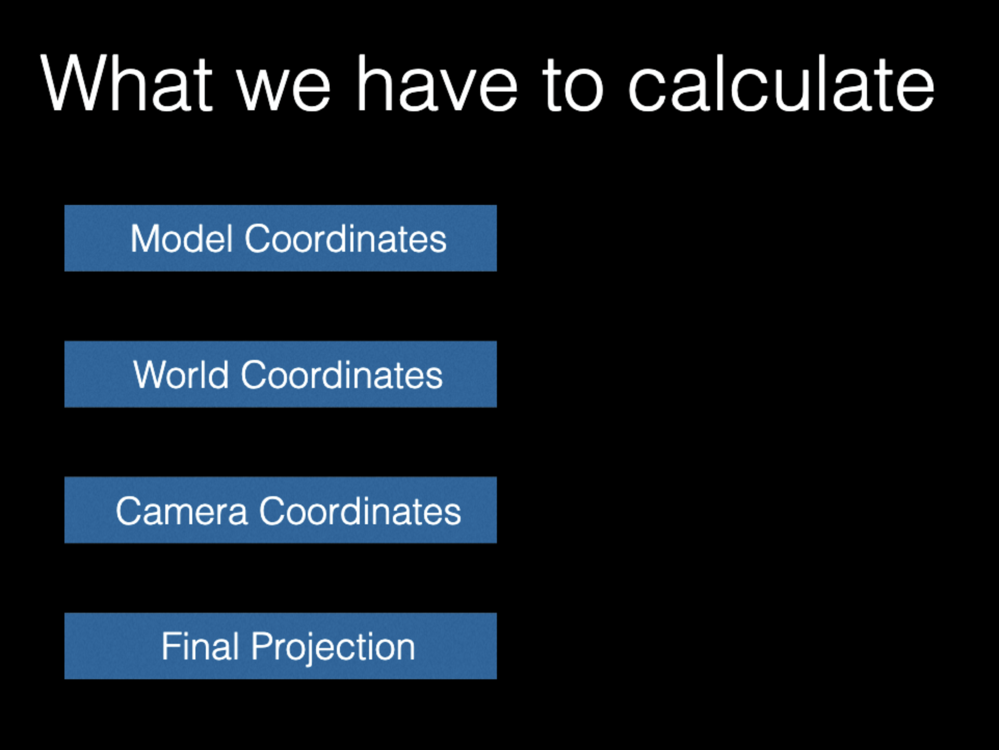
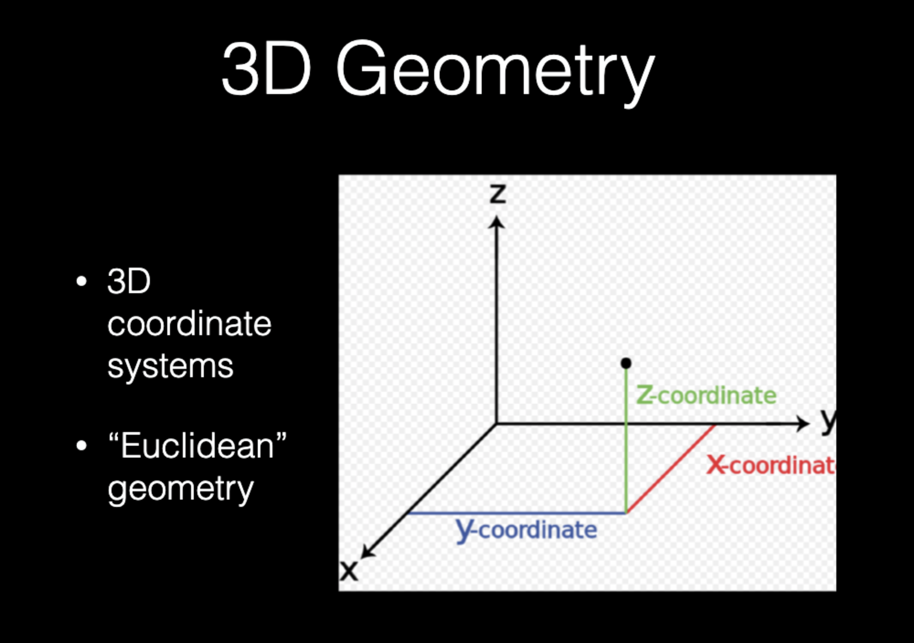

# 随机粒子冲撞
#代码 #3d
``` javascript
<html>
<head>
</head>

<style>

/*  
    This is to make sure
    the canvas is in the right position
    on all browsers    
*/

canvas {
position: absolute;
top:0;
left:0;
}

</style>

<body>
<canvas></canvas>

<script>

var canvas = document.querySelector("canvas");
var width = window.innerWidth;
var height = window.innerHeight;
var context = canvas.getContext("2d");
canvas.setAttribute("width", width);
canvas.setAttribute("height", height);


var fov = 200;
//所谓的焦距数值
var point = [];
//单个点的xyz
var points = [];
//所有点的集合
var point3d = [];
//所有3d点的集合
var HALF_WIDTH = width / 2;
var HALF_HEIGHT = height / 2;
//半高半宽
var numPoints = 1000;
//1000个点
var x3d = 0;
var y3d = 0;
var z3d = 0;
//xyz的初始值可能
for (var i = 0; i < numPoints; i++) {
    point = [(Math.random() * width / 2) - width / 4, (Math.random() * height / 2) - height / 4, (Math.random() * width / 2) - width / 4];
//点的xyz坐标分别等于，随即宽度/2-宽度/4，随机高度/2-高度/4，随机宽度2-宽度/4。所以这里返回的数值是-width/4~width/4之间
    points.push(point);
  //遍历1000次增加1000个点
}

function draw() {
    
// This just clears the screen    
    context.fillStyle = "rgb(0,0,0)";
    context.fillRect(0, 0, width, height);
// This loop takes a bunch of 3D vertices and draws them using a 2D perspective projection
    for (var i = 0; i < numPoints; i++) {
        // Get a vertex
        point3d = points[i];
//往3dpoint里面塞点里面塞点
        // // Get the z coordinate - this is the depth
        z3d = point3d[2];
        //每次都给z3d赋值为-width/4~width/4之间的数值
        // substract a value - this will move it along the z axis.
        z3d -= 10;
        //不断的自己减自己
        // if the z coordinate for this vertex is less than the Fielf of View (FOV),
        // Add half the width to move it back. This makes an endless starfield.
        // feel free to disable this if you want...
        if (z3d < -fov) z3d += HALF_WIDTH;
        //这个的字面意思有点像是，z轴超出了一定范围这之后，让它返回到一半的宽度，也就是类似倒带的感觉
        // replace the original z position with this new z position.    
        point3d[2] = z3d;
        
        // Now get all the vertices        
        x3d = point3d[0];
        y3d = point3d[1];
        z3d = point3d[2];
        //不断地从数组中取数
        // Decide on the size of the point by taking the FOV and dividing it by the FOV + the z pos
        var scale = fov / (fov + z3d);//这里返回的数值是200～0（无限接近于0）
        
        //scale = 1.0;
        // Now create the 2D perspective projection.
        // create a 2D x and y position by multiplying the x and y coordinates by the scale
        // Add half the width and height to translate the coordinates to the origin.
        var x2d = (x3d * scale) + HALF_WIDTH;
        var y2d = (y3d * scale) + HALF_HEIGHT;
//这里的半高半宽都是常量，可以先忽略。所以实际上每次2d 3d的点都是按比例来变化的，因为scale是一个曲线（如果有小数点就是曲线了）

        // Draw a square of size 'scale', in position x2d, y2d.
        // This code is more complex than you might be used to because it's pure JS.
        context.lineWidth = scale;//这个实际上是线的粗细，实际上z3d是会不断的变小的（到-200）。那意味着scale是会越来越大，从视觉上我们就会觉得他们很近了
        context.strokeStyle = "rgb(255,255,255)";
        context.beginPath();
        context.moveTo(x2d, y2d);//所以这里的点，本身的值也会增大，就造就了不断移动的错觉。   
        context.lineTo(x2d + scale, y2d);
        context.stroke();
        //这个整体逻辑应该是，每次遍历都只画1000个点。然而由于每次z3d都在减少，而每次beginpath绘制的路径都在变化，所以这个就是图像不断移动的原因了//
        //That really is it...
        
    }
	requestAnimationFrame(draw);
}

	requestAnimationFrame(draw);

</script>

</body>

</html>
```



